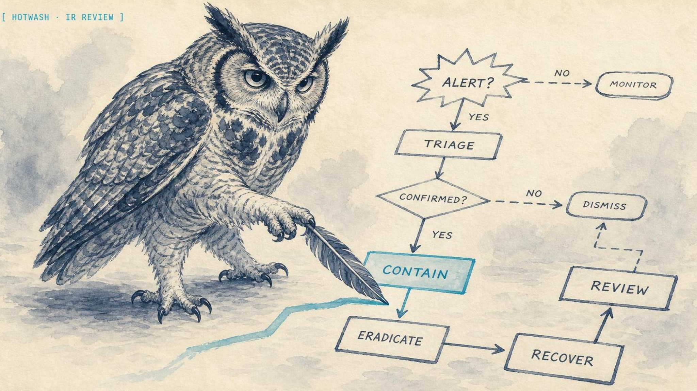
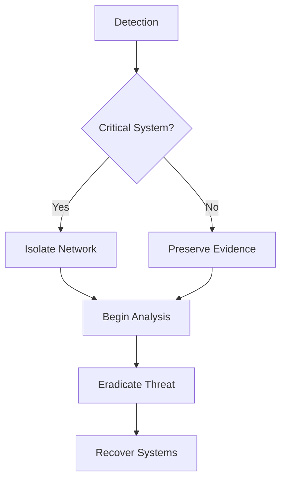

<p align="center">
  
</p>

<h1 align="center">⚒️ Hotwash</h1>

<p align="center">
  <strong>Interactive incident-response runbooks: build IR playbooks as visual flowcharts, execute them step-by-step, and drive whole runs from an LLM over MCP.</strong>
</p>

<p align="center">
  <a href="https://lidless.dev/hotwash"><strong>Website</strong></a>
  &nbsp;·&nbsp;
  <a href="https://www.npmjs.com/package/hotwash-mcp">hotwash-mcp on npm</a>
  &nbsp;·&nbsp;
  <a href="docs/WAZUH-INGEST.md">Wazuh ingest</a>
  &nbsp;·&nbsp;
  <a href="docs/ROADMAP.md">Roadmap</a>
</p>

<p align="center">
  
  
  
  
  
</p>

Hotwash turns incident-response (IR) playbooks written in Markdown or Mermaid into interactive flowchart runbooks with a real execution engine, so a SOC analyst can build a runbook, kick off a run against a live incident, and track every step, decision, and piece of evidence. The point is that the same run is also drivable by an AI agent: the bundled `hotwash-mcp` Model Context Protocol server exposes the run engine as tools, so an LLM can list playbooks, start a run, advance steps, attach artifacts, and triage the Wazuh ingest queue. Unlike a static playbook doc or a flowchart drawing tool, every Hotwash run is live, audited state that a human and an agent can share.

> Status: WIP. The web app, the FastAPI run engine, the `hotwash-mcp` server (published to npm), and the Wazuh ingest path are working and tested. Some SOAR actions are templates, and the surface is still moving. See [Roadmap](docs/ROADMAP.md).

---

## What it does

Hotwash is an incident-response (IR) runbook tool for SOC and blue-team work. It does three things that usually live in three different tools:

- **Authoring.** Parse structured Markdown or Mermaid playbooks into a node-edge graph and render them on an interactive React Flow canvas (phases, steps, decisions, execute nodes, merges). Browse, categorize, and filter a playbook library by type (Incident Response, Vulnerability, Threat Hunting).
- **Execution.** Start a run from a playbook, then walk it step-by-step with live status, timestamps, assignees, notes, decisions, and attached evidence. Every run is queryable state, not a checklist someone re-types into a ticket.
- **Automation.** The `hotwash-mcp` MCP server lets an AI agent drive runs end to end, and the Wazuh ingest path turns alerts into either an auto-started run or a human-review suggestion via HMAC-authenticated mappings.

Keywords: incident response, IR runbooks, SOC, SOAR, playbook automation, Model Context Protocol (MCP), Wazuh alert ingestion, blue team.

---

## Quick Start

```bash
# Clone and install
git clone https://github.com/lidless-labs/hotwash.git
cd hotwash

# Frontend (web app)
cd web && npm install && npm run dev

# Backend (run engine + REST API + MCP backend, from the repo root)
python3 -m venv .venv && .venv/bin/pip install -r requirements.txt
.venv/bin/uvicorn api.main:app --port 8000
```

Frontend: **http://localhost:5177**
Backend: **http://localhost:8000**

The web app works offline for visualization without the backend. The backend is required for the execution engine, the REST API, the MCP server, and Wazuh ingest.

---

## MCP server: drive runs from an LLM

`hotwash-mcp` ([on npm](https://www.npmjs.com/package/hotwash-mcp)) is a stdio MCP server that wraps the Hotwash REST API. Point it at a running Hotwash backend and any MCP-capable client (Claude Desktop, Claude Code, Cursor, and others) can run incident-response playbooks as tools.

Add it to your MCP client config:

```json
{
  "mcpServers": {
    "hotwash": {
      "command": "npx",
      "args": ["-y", "hotwash-mcp"],
      "env": {
        "HOTWASH_URL": "http://localhost:8000",
        "HOTWASH_API_KEY": "your-hotwash-api-key"
      }
    }
  }
}
```

Environment variables read by the server: `HOTWASH_URL` (default `http://localhost:8000`), `HOTWASH_API_KEY` (optional, sent as the API key when the backend requires auth), and `HOTWASH_TIMEOUT` (request timeout in seconds, default `30`).

### Tools

The server registers 10 tools, all prefixed `hotwash_`:

| Tool | What it does |
|------|--------------|
| `hotwash_list_playbooks` | List playbooks in the library with optional category/tag/search filters; returns id, title, category, tags, and node count. |
| `hotwash_get_playbook` | Fetch the full graph (nodes + edges) and metadata for one playbook by id. |
| `hotwash_start_run` | Start a new execution of a playbook against an incident; clones nodes into per-step state and returns the execution id. |
| `hotwash_query_run` | Get current execution state: status, the full step list with statuses/evidence/notes, and optionally the timeline. |
| `hotwash_advance_step` | Update a single step: change status, assign an analyst, append a note, or record a decision. |
| `hotwash_cancel_run` | Abandon an in-progress run (stays queryable for the audit log). Destructive; requires `confirm: true`. |
| `hotwash_attach_artifact` | Attach a text or base64 binary artifact (log snippet, screenshot, hash list) to a step. |
| `hotwash_list_suggestions` | List ingest suggestions queued from `mode=suggest` Wazuh mappings (the analyst review queue). |
| `hotwash_accept_suggestion` | Promote a pending suggestion into a real execution, carrying its Wazuh alert as context. Destructive; requires `confirm: true`. |
| `hotwash_dismiss_suggestion` | Dismiss a pending suggestion as noise and anchor the mapping cooldown. Destructive; requires `confirm: true`. |

Destructive tools (`hotwash_cancel_run`, `hotwash_accept_suggestion`, `hotwash_dismiss_suggestion`) refuse to act unless the caller passes `confirm: true`, so an agent cannot abandon a run or burn through the suggestion queue by accident.

---

## Features

- **Markdown to Flowchart** - Parse structured Markdown playbooks into node-edge graphs
- **Mermaid Syntax** - Native support for Mermaid flowchart syntax
- **Interactive Canvas** - Drag, pan, zoom with React Flow
- **Custom Node Types** - Phase, Step, Decision, Execute, Merge with 5 variant styles
- **Playbook Library** - Browse, categorize, and filter by type (Vulnerability, Incident Response, Threat Hunting)
- **Execution Engine** - Run playbooks step-by-step with live status tracking, timestamps, and execution history
- **AI Playbook Generation** - Generate complete playbooks from natural language incident descriptions
- **SOAR Integration** - Built-in action library with connections to real response platforms
- **MCP Integration** - Model Context Protocol server so AI agents can drive runs
- **Wazuh Ingest** - HMAC-authenticated alert ingestion with mapping rules and a suggestion queue
- **MiniMap & Controls** - Bird's-eye view and viewport navigation
- **Client-Side Parsing** - Zero-latency Markdown rendering in browser
- **5 Visual Themes** - SOC, Analyst, Terminal, Command, Cyber variants
- **Guided Tour** - Interactive walkthrough for first-time users
- **Offline-First** - No backend required for visualization

---

## Tech Stack

| Layer | Technology | Purpose |
|-------|-----------|---------|
| **Frontend** | React 18.2 | Interactive dashboards |
| **Language** | TypeScript 5.3 | Type safety |
| **Styling** | Tailwind CSS 3.4 | Utility-first CSS |
| **Canvas** | React Flow Renderer 10.3 | Node-edge graph visualization |
| **State** | Zustand | Global state management |
| **Bundler** | Vite 5 | Dev server and build |
| **Backend** | FastAPI 0.136 | Playbook storage, execution engine, integrations |
| **MCP** | @modelcontextprotocol/sdk 1.29 | `hotwash-mcp` server (Node >= 20) |
| **Parser** | Custom Markdown Parser | Inline playbook parsing |

---

## Playbook Syntax

### Markdown Format

```markdown
# Incident Response: Ransomware Attack

## Phase: Detection
- Step: Identify affected systems
  - Check EDR alerts
  - Correlate with SIEM events
  - Document initial indicators

## Phase: Analysis
- Decision: Is it a critical system?
  - YES -> Execute: Isolate from network
  - NO -> Execute: Begin forensic collection

## Phase: Containment
- Step: Isolate affected hosts
  - Segment network access
  - Disable user accounts
  - Preserve evidence

## Phase: Eradication
- Step: Remove malware
  - Scan with multiple AV engines
  - Remove registry keys
  - Patch vulnerabilities

## Phase: Recovery
- Step: Restore systems
  - Restore from clean backups
  - Apply security patches
  - Re-enable user access
```

### Mermaid Format



---

## Node Types

| Type | Purpose | Example |
|------|---------|---------|
| **Phase** | Major incident response phase | Detection, Analysis, Containment |
| **Step** | Procedural action | Execute EDR scan, Document findings |
| **Decision** | Conditional branch (Yes/No) | Is it critical? Is malware present? |
| **Execute** | SOAR action or tool integration | Isolate host, Disable account, Block IP |
| **Merge** | Convergence point | Rejoining analysis paths |

---

## 5 Variants

| Variant | Theme | Use Case |
|---------|-------|----------|
| **SOC** | Dark slate, red accents | Security operations center |
| **Analyst** | Clean white, blue | Professional analysis |
| **Terminal** | Black, matrix green | Technical incident response |
| **Command** | OD green, amber | Military-style operations |
| **Cyber** | Neon cyan/magenta | Cyberpunk aesthetic |

All variants use the same parsing engine and React Flow canvas. Switch themes instantly.

---

## Project Structure

```text
hotwash/
├── web/                      # React 18 + TypeScript + Vite frontend
│   ├── src/
│   │   ├── components/       # FlowCanvas (React Flow), panels, viewers
│   │   ├── pages/            # Editor, Library, Executions, Suggestions, ...
│   │   ├── parsers/          # Client-side Markdown/Mermaid parsing
│   │   ├── api/              # Backend API client
│   │   ├── hooks/            # useExecutionSocket and friends
│   │   └── variants/         # Theme layouts
│   ├── package.json
│   └── vite.config.ts
├── api/                      # FastAPI backend (run engine + REST API)
│   ├── main.py               # Entry point
│   ├── routers/              # playbooks, executions, export, ingest, integrations, parse
│   ├── services/             # Execution engine, ingest matching, tags
│   ├── parsers/              # Markdown + Mermaid parsers
│   ├── integrations/         # SOAR integration clients (TheHive)
│   └── tests/                # pytest suite
├── mcp/                      # hotwash-mcp npm package (MCP server, Node >= 20)
│   ├── src/index.ts          # Entry point
│   └── src/tools/            # playbooks, runs, suggestions, artifacts tools
├── docs/                     # ARCHITECTURE, CONFIGURATION, THEHIVE-INTEGRATION, WAZUH-INGEST
└── requirements.txt
```

---

## SOAR Actions

Built-in action library for common SOAR platforms:

**Incident Response Actions:**
- `isolate_host` - Remove host from network
- `disable_account` - Disable user account
- `block_ioc` - Block IP/domain/hash
- `snapshot_vm` - Create VM snapshot
- `quarantine_email` - Isolate email message

**Reconnaissance:**
- `whois_lookup` - IP/domain registration info
- `virustotal_check` - File hash reputation
- `shodan_search` - Internet scan results

All actions are templates that teams can customize.

---

## Wazuh integration

Hotwash accepts Wazuh alerts via `POST /api/ingest/wazuh` (HMAC-authenticated)
and matches them against a mapping table that can `auto`-start a run, queue a
human-review suggestion, or log only. Mappings are managed via
`/api/ingest/mappings` CRUD. See [docs/WAZUH-INGEST.md](docs/WAZUH-INGEST.md)
for the integration script template, HMAC scheme, and cooldown semantics.

---

## Roadmap

Shipped: the `hotwash-mcp` Model Context Protocol server (on npm) that lets AI agents drive playbook runs, and the Wazuh alert ingestion path with HMAC auth, mapping rules, and a human-review suggestion queue. Next up: richer execution reporting, more SOAR targets beyond TheHive, and deeper suggestion-queue workflows.

See [docs/ROADMAP.md](docs/ROADMAP.md) for the full plan.

---

## Why not just a Markdown doc or a flowchart tool?

- **vs. a playbook in a wiki or Markdown file:** a doc is read-only prose. Hotwash runs the playbook: live step status, timestamps, assignees, decisions, and attached evidence become queryable state and an audit trail, not a checklist someone re-types into a ticket.
- **vs. a diagram tool (Mermaid Live, draw.io, Lucidchart):** those draw the flowchart and stop there. Hotwash parses the same Markdown/Mermaid into a graph *and* executes it, with an engine, a run history, and an MCP surface an agent can drive.
- **vs. a full commercial SOAR platform:** Hotwash is a local-first, MIT-licensed, self-hosted runbook engine you can read and extend. SOAR actions ship as customizable templates; the design is human-and-agent in the loop, not a black box that fires playbooks autonomously.

## What Hotwash is not

- Not a SIEM and not a detection engine. It ingests Wazuh alerts; it does not generate them.
- Not a turnkey SOAR with vendor integrations for every tool. SOAR actions (`isolate_host`, `block_ioc`, and friends) are templates teams customize; TheHive is the one live integration today.
- Not a hosted or multi-tenant service. It is a self-hosted app you run yourself.
- Not a fully autonomous responder. Destructive MCP tools require explicit confirmation, and `mode=suggest` Wazuh mappings route to a human-review queue by design.
- Not finished. It is WIP; expect the surface to change.

---

## Contributing & security

- [CONTRIBUTING.md](CONTRIBUTING.md) - how to set up, what lands easily, and what needs an issue first.
- [SECURITY.md](SECURITY.md) - how to report a vulnerability (please do not open a public issue).
- [CODE_OF_CONDUCT.md](CODE_OF_CONDUCT.md) - Contributor Covenant 2.1.
- [CHANGELOG.md](CHANGELOG.md) - notable changes.

---

## License

MIT - see [LICENSE](LICENSE) for details.
